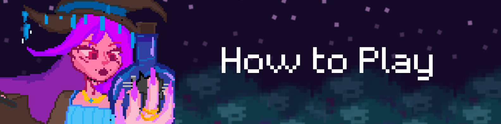
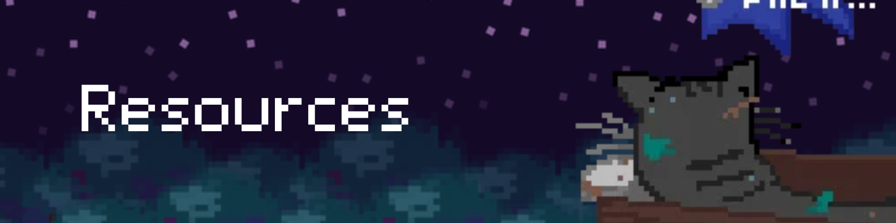

# WitchyWare

## ---Escape the Immortal Witch of Gaeia---

You and your sister were escaping the Evil Witch of Gaeia Cliff after she turned you both into cats. However, during the chase, you and your sister accidentally went into different directions and the witch unfortunately chose to chase after YOU!

Use left (←) and right (→) arrows to move!

Use the space button to jump! 

### endings:

<b>Ending 1:</b>
You escaped into a moving cat entering the kingdom.
<b>Ending 2:</b> 
The witch caught up with you and stored you in a bottle.

### Visuals/Art/Audio
<a href= "https://www.pixilart.com">Pixilart.com</a>
=> Free pixel art tool, you can also make gifs or animations here!

<a href="canva.com">Canva</a>
=> Where I put together the pixel art to make banners or backgrounds.

<a href="bandlab.com">BandLab</a>
=> Free tool to make music. This is where I made the soundtrack for this game. I didn't use any samples for the soundtrack.

### GDScript Tutorials

<a href="https://youtu.be/zHYkcJyE52g?si=PzgeIhijcpO71c9v">Title Screen Tutorial</a>
=> Making buttons + settings menu

<a href="https://youtu.be/EheekoQZ_nE?si=svBjuj58PBZyoHxI">Options Menu Tutorial</a>
=> Making audio adjuster

<a href="https://youtu.be/V9kshvtj6s0?si=2OYFv96Xo20SFQxR">Animation tutorial</a>
=> Basics on how to make ur sprites do animations

<a href="https://youtu.be/oED12Mo2018?si=MKt242utlFfkgrCh">Platformer + Player tutorial</a>
=> Where I got some of my player code

Stardance WarioWare Mission 1

##
game lowk also for a game dev studio im planning to do so go support this one chat